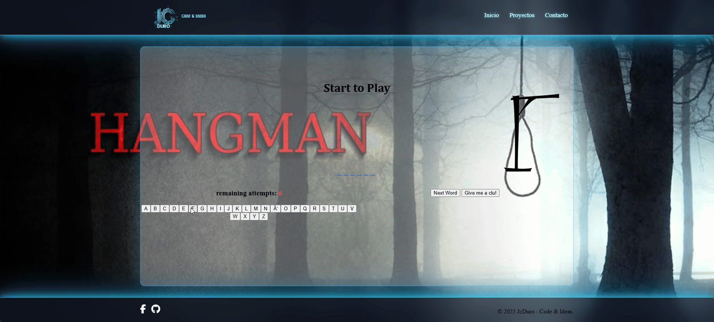

## Hang Man Game

¡Bienvenido al clásico juego del Ahorcado desarrollado con JavaScript, HTML y CSS!

---

📷 Descripción

Juega directamente en línea y desafía tus conocimientos para adivinar la palabra oculta antes de quedarte sin intentos.

---

🖼️ Vista previa



--- 

✨ Pruebalo Online

[HangMan](https://jcduro.bexartideas.com/proyectos/hang_man_game/index.php)

--- 

🚀 Características
- Interfaz de usuario amigable y responsiva.
- Juego interactivo con tablero de letras y visualización de pistas.
- Contador de intentos y letras incorrectas.
- Animación visual para resultado de “Game Over” y “Victoria”.
- Opción para pedir una pista.
- Compatible con navegadores modernos.

---

📊 Lenguajes y Herramientas

[](https://skillicons.dev)

---

📦 Instalación Local
Si quieres instalar y ejecutar el juego en tu máquina local:

Clona el repositorio:

  ```bash
git clone https://github.com/jcduro/hang_man_game.git
Accede a la carpeta del proyecto:
```

  ```bash
cd hang_man_game
Abre index.html en tu navegador.
```

🕹️ ¿Cómo Jugar?
Haz clic en cada letra del abecedario para intentar adivinar la palabra.
Cada error resta un intento, ¡cuidado!
Usa el botón “Give me a clue!” para recibir una pista (opcional).
Ganas si completas la palabra antes de agotar los intentos.

---

📂 Estructura de Archivos
index.html → Página principal del juego
hang.css → Estilos visuales y animaciones
hang.js → Lógica y control del juego

---

🙋‍♂️ Autor
Desarrollado por JcDuro
© 2025 JcDuro - Code & Ideas

---

📝 Licencia
Este proyecto es de código abierto. Puedes modificarlo y adaptarlo para fines educativos o personales.
